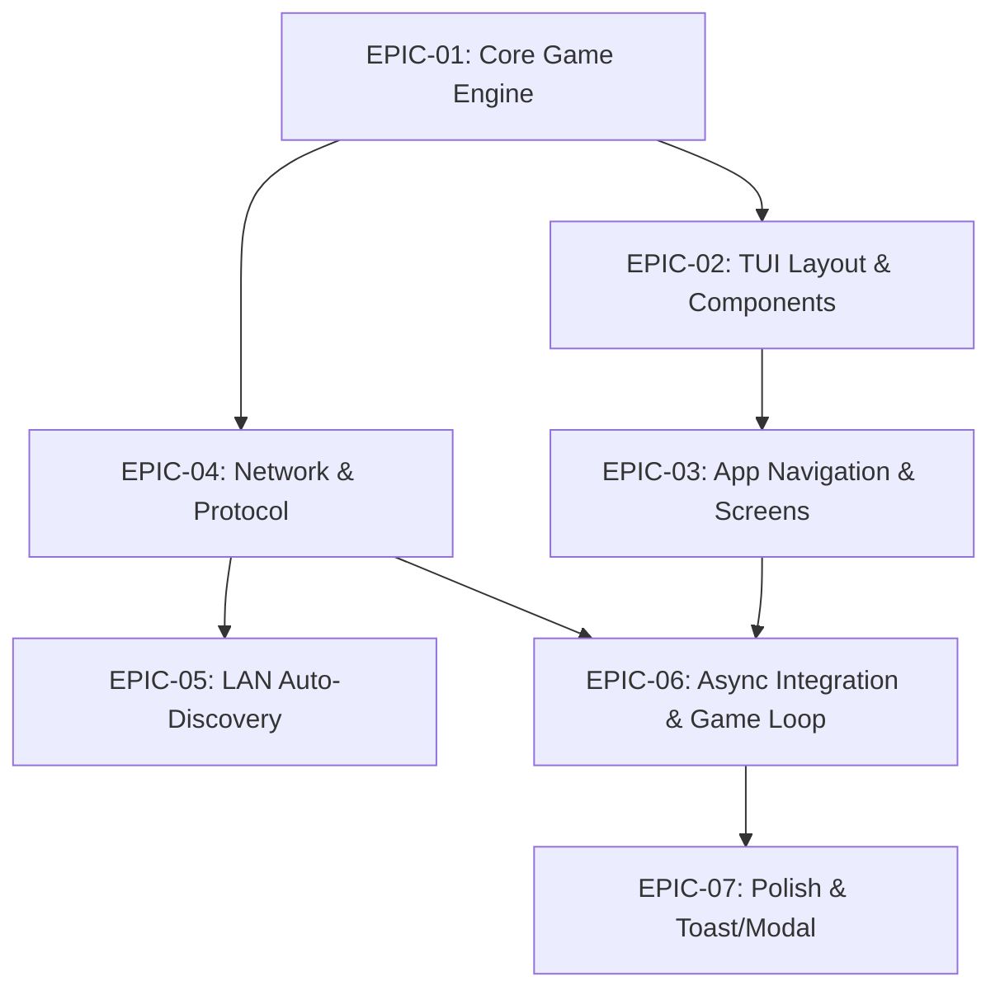

# ShipWrek CLI – Product Backlog & Task Breakdown

> Danh sách tổng hợp các Epic, User Story và Task chi tiết, sắp xếp theo thứ tự ưu tiên (Priority) và sự phụ thuộc (Prerequisites).

---

## 1. Bảng quy ước định danh (Legend & Key)

### Mức độ ưu tiên (Priority)
- **`P0 - Critical`**: Bắt buộc phải có để ứng dụng hoạt động được (Must-Have).
- **`P1 - High`**: Chức năng chính quan trọng của luồng chơi (High Value).
- **`P2 - Medium`**: Cải thiện trải nghiệm UI/UX và tính năng bổ trợ.
- **`P3 - Low`**: Tính năng mở rộng, trang trí hoặc refactor sau.

### Trạng thái (Status)
- `[ ]` **Todo**: Chưa thực hiện
- `[/]` **In Progress**: Đang thực hiện
- `[x]` **Done**: Đã hoàn thành

---

## 2. Dependency Matrix (Ma trận phụ thuộc)

---

## 3. Danh sách Task chi tiết (Detailed Task Breakdown)

### 📦 EPIC 01: Core Game Engine (`internal/game`)
*Mục tiêu: Xây dựng toàn bộ logic game thuần (Domain Model), không phụ thuộc UI hay Network.*

| Task ID | Tiêu đề Task | Mô tả chi tiết | Priority | Prerequisites | SP | Status |
| :--- | :--- | :--- | :---: | :---: | :---: | :---: |
| **TSK-101** | Define Board & Coordinate Data Models | Tạo struct `Coordinate(X, Y)`, `Board(10x10)`, `CellState` (Empty, Ship, Hit, Miss) trong `internal/game/board.go` | **P0** | None | 2 | `[ ]` |
| **TSK-102** | Define Ship & Fleet Structs | Tạo struct `Ship` (Type, Length, Coordinates, Hits) và danh sách 5 loại tàu tiêu chuẩn trong `internal/game/ship.go` | **P0** | TSK-101 | 2 | `[ ]` |
| **TSK-103** | Ship Placement Rules & Validation | Viết logic validate vị trí đặt tàu (`CanPlaceShip`): kiểm tra ranh giới cờ $10 \times 10$, va chạm trùng lặp, xoay tàu ngang/dọc trong `internal/game/rules.go` | **P0** | TSK-102 | 3 | `[ ]` |
| **TSK-104** | Shooting & Hit Engine Logic | Viết hàm `ReceiveShot(coord)`: cập nhật trạng thái ô bàn cờ, ghi nhận Hit/Miss, kiểm tra tàu chìm (`IsSunk`) và đếm số tàu còn lại | **P0** | TSK-103 | 3 | `[ ]` |
| **TSK-105** | Match State Machine & Turn Manager | Quản lý trạng thái trận đấu (`MatchState`: Setup, PlayerTurn, EnemyTurn, GameOver) trong `internal/game/match.go` | **P0** | TSK-104 | 3 | `[ ]` |
| **TSK-106** | Unit Tests for Engine | Viết Unit Test phủ toàn bộ case: đặt tàu đè nhau, bắn trúng/trượt, đánh chìm hạm đội và điều kiện thắng | **P1** | TSK-105 | 2 | `[ ]` |

---

### 🎨 EPIC 02: TUI Theme & Core Component Library (`internal/theme`, `internal/component`)
*Mục tiêu: Dùng Lip Gloss & Bubbles xây dựng hệ thống UI kit và các component tái sử dụng.*

| Task ID | Tiêu đề Task | Mô tả chi tiết | Priority | Prerequisites | SP | Status |
| :--- | :--- | :--- | :---: | :---: | :---: | :---: |
| **TSK-201** | Theme & Lip Gloss Design System | Định nghĩa bảng màu (Primary, Accent, Success, Danger, Subdued), typography và style khung viền (Borders) trong `internal/theme/` | **P1** | None | 2 | `[ ]` |
| **TSK-202** | Icon Mapping with ASCII Fallback | Tạo bảng tra cứu Icon Unicode (⚓, ■, ╳, ○, ◉) kèm cơ chế tự động fallback ASCII nếu terminal là ANSI cơ bản | **P2** | TSK-201 | 1 | `[ ]` |
| **TSK-203** | Renderable Board Component | Component vẽ bàn cờ $10 \times 10$ kèm nhãn hàng/cột (A-J, 1-10), tô màu trạng thái ô và hiển thị cursor di chuyển | **P0** | TSK-101, TSK-201 | 3 | `[ ]` |
| **TSK-204** | Fleet Status Component | Component danh sách 5 loại tàu bên lề: thanh máu (HP bar), biểu tượng sống/chìm | **P1** | TSK-102, TSK-201 | 2 | `[ ]` |
| **TSK-205** | Status Bar & Header Component | Component hiển thị tiêu đề top bar (IP, ping, lượt chơi) và bottom bar gợi ý phím tắt (`q`, `r`, `enter`, `tab`, `?`) | **P1** | TSK-201 | 2 | `[ ]` |

---

### 🖥️ EPIC 03: App Router & Screen Models (`internal/app`, `internal/screen`)
*Mục tiêu: Dựng các màn hình theo kiến trúc Elm của Bubble Tea và bộ chuyển cảnh.*

| Task ID | Tiêu đề Task | Mô tả chi tiết | Priority | Prerequisites | SP | Status |
| :--- | :--- | :--- | :---: | :---: | :---: | :---: |
| **TSK-301** | Main Router & Window Resize Handler | Dựng Root Model `app.Model` điều hướng giữa các màn hình và lắng nghe `tea.WindowSizeMsg` để căn chỉnh kích thước | **P0** | TSK-201 | 3 | `[ ]` |
| **TSK-302** | Main Menu Screen | Màn hình menu chính (Host, Join, How to Play, Quit) chọn phím mũi tên và Enter | **P0** | TSK-301 | 2 | `[ ]` |
| **TSK-303** | Fleet Placement Screen Model | Giao diện đặt tàu: tương tác di chuyển cursor, bấm `R` xoay tàu, bấm `Enter` đặt, kiểm tra xem đủ 5 tàu để bật nút Ready | **P0** | TSK-103, TSK-203 | 5 | `[ ]` |
| **TSK-304** | Battle Screen Layout Integration | Đặt 2 bàn cờ (Your Fleet vs Enemy Waters) song song, quản lý cursor bắn trên bàn địch và cập nhật lượt chơi | **P0** | TSK-203, TSK-204 | 5 | `[ ]` |
| **TSK-305** | Result & Summary Screen | Màn hình kết quả trận đấu khi kết thúc: thông báo Thắng/Thua, chỉ số bắn trúng/trượt, lựa chọn Đấu lại/Thoát | **P1** | TSK-304 | 2 | `[ ]` |

---

### 🌐 EPIC 04: Networking & Protocol Layer (`internal/network`)
*Mục tiêu: Xây dựng hạ tầng TCP giao tiếp và mã hóa gói tin JSON Lines.*

| Task ID | Tiêu đề Task | Mô tả chi tiết | Priority | Prerequisites | SP | Status |
| :--- | :--- | :--- | :---: | :---: | :---: | :---: |
| **TSK-401** | JSON Protocol Message Structs | Khai báo các Struct gói tin JSON: `HelloMsg`, `ReadyMsg`, `PlaceMsg`, `ShootMsg`, `ResultMsg`, `RematchMsg` trong `protocol.go` | **P0** | None | 2 | `[ ]` |
| **TSK-402** | TCP Server (Host Mode) | Khai báo `net.Listen("tcp", port)` tạo phòng host, chấp nhận 1 Client kết nối vào | **P0** | TSK-401 | 3 | `[ ]` |
| **TSK-403** | TCP Client (Join Mode) | Khai báo `net.Dial("tcp", hostAddr)` kết nối tới phòng Host | **P0** | TSK-401 | 2 | `[ ]` |
| **TSK-404** | Peer Reader/Writer Abstraction | Wrapper `bufio.Scanner` đọc từng dòng JSON (`\n`) và `json.Encoder` gửi gói tin an toàn không nghẽn thread | **P0** | TSK-402, TSK-403 | 3 | `[ ]` |

---

### 📡 EPIC 05: LAN Auto-Discovery (`internal/network/discovery.go`)
*Mục tiêu: Tự động quét và hiển thị các Host đang mở phòng trong mạng LAN.*

| Task ID | Tiêu đề Task | Mô tả chi tiết | Priority | Prerequisites | SP | Status |
| :--- | :--- | :--- | :---: | :---: | :---: | :---: |
| **TSK-501** | UDP Broadcast Beacon (Host Side) | Server phát gói tin UDP Broadcast định kỳ (1-2s/lần) chứa tên phòng, IP, Port | **P2** | TSK-402 | 3 | `[ ]` |
| **TSK-502** | UDP Listener & Discovery List (Client Side) | Client nghe trên cổng UDP Beacon, tổng hợp danh sách các phòng khả dụng lên giao diện màn hình Join Lobby | **P2** | TSK-501 | 3 | `[ ]` |

---

### ⚡ EPIC 06: Async Integration & Game Loop Sync (`internal/app`, `internal/screen`)
*Mục tiêu: Kết nối luồng mạng vào vòng lặp Bubble Tea Event Loop.*

| Task ID | Tiêu đề Task | Mô tả chi tiết | Priority | Prerequisites | SP | Status |
| :--- | :--- | :--- | :---: | :---: | :---: | :---: |
| **TSK-601** | Async Network Command (`tea.Cmd`) | Viết helper `WaitForNetworkMessage(peer)` trả về `tea.Msg` khi có dữ liệu mới từ TCP socket | **P0** | TSK-301, TSK-404 | 5 | `[ ]` |
| **TSK-602** | Sync Handshake & Placement Phase | Đồng bộ trạng thái sẵn sàng (`READY`) giữa 2 người chơi trước khi bắt đầu vào màn hình Battle | **P0** | TSK-303, TSK-601 | 3 | `[ ]` |
| **TSK-603** | Real-time Combat Sync Loop | Đồng bộ lượt bắn (`SHOOT`), phản hồi kết quả (`SHOT_RESULT`), cập nhật bàn cờ của cả 2 bên theo thời gian thực | **P0** | TSK-304, TSK-601 | 5 | `[ ]` |
| **TSK-604** | Disconnection & Reconnect Toast Handling | Xử lý khi đối thủ mất kết nối đột ngột: hiển thị popup thông báo và đưa người chơi về Main Menu an toàn | **P1** | TSK-603 | 2 | `[ ]` |

---

### ✨ EPIC 07: Polish, Modals & User Experience (`internal/component`, `internal/screen`)
*Mục tiêu: Tăng trải nghiệm người dùng với animation, modal, toast và tối ưu hóa.*

| Task ID | Tiêu đề Task | Mô tả chi tiết | Priority | Prerequisites | SP | Status |
| :--- | :--- | :--- | :---: | :---: | :---: | :---: |
| **TSK-701** | Animated Lobby Spinner | Tích hợp component `bubbles/spinner` tạo hiệu ứng xoay chờ đối thủ trong LAN Lobby | **P2** | TSK-302, TSK-402 | 1 | `[ ]` |
| **TSK-702** | Help Overlay Modal (`?` Key) | Dựng modal overlay giải thích chi tiết luật chơi và bộ phím tắt khi nhấn phím `?` | **P2** | TSK-205 | 2 | `[ ]` |
| **TSK-703** | Toast Notification System | Hiển thị thông báo Toast góc màn hình khi phát bắn Trúng/Trượt/Sunk hoặc khi nhận được lượt | **P2** | TSK-304 | 3 | `[ ]` |
| **TSK-704** | Entry point `cmd/shipwrek/main.go` & Flag options | Viết file `main.go` khởi tạo Bubble Tea program (`tea.NewProgram`), xử lý CLI flags (port, username) | **P0** | TSK-301, TSK-603 | 2 | `[ ]` |

---

## 4. Kế hoạch triển khai theo Sprint (Suggested Roadmap)

### 🚀 Sprint 1: Foundation & Core Engine (Sprint Goal: Logic Game chuẩn)
- Core Tasks: `TSK-101`, `TSK-102`, `TSK-103`, `TSK-104`, `TSK-105`, `TSK-106`
- Key Deliverable: Module `internal/game` với 100% Pass Unit Test.

### 🎨 Sprint 2: TUI Layout & Offline Screens (Sprint Goal: Đặt tàu & Giao diện bắn offline)
- Core Tasks: `TSK-201`, `TSK-202`, `TSK-203`, `TSK-204`, `TSK-205`, `TSK-301`, `TSK-302`, `TSK-303`, `TSK-304`
- Key Deliverable: App TUI hiển thị đẹp, cho phép chọn menu, thao tác di chuyển cursor đặt tàu và bắn thử nghiệm offline.

### 🌐 Sprint 3: Network Layer & Async Integration (Sprint Goal: Chơi Multiplayer qua LAN)
- Core Tasks: `TSK-401`, `TSK-402`, `TSK-403`, `TSK-404`, `TSK-601`, `TSK-602`, `TSK-603`, `TSK-704`
- Key Deliverable: 2 máy trong cùng LAN có thể Host/Join và chơi hoàn chỉnh 1 trận Battleship qua Terminal.

### ✨ Sprint 4: LAN Auto-Discovery & UX Polish (Sprint Goal: Quét LAN tự động & Hoàn thiện UI)
- Core Tasks: `TSK-501`, `TSK-502`, `TSK-305`, `TSK-604`, `TSK-701`, `TSK-702`, `TSK-703`
- Key Deliverable: Bản phát hành ShipWrek CLI v1.0 hoàn chỉnh với UDP Auto-Discovery, Toast, Spinner & Modal help.
